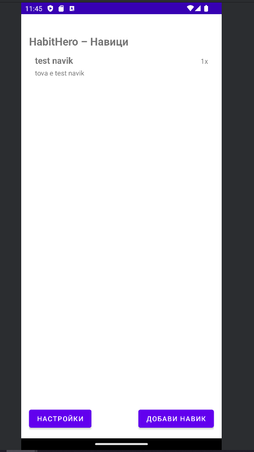
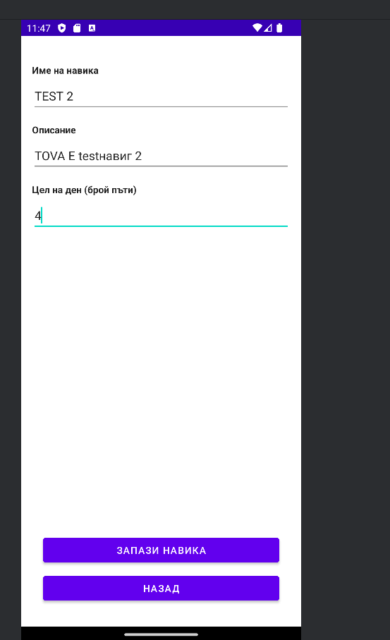
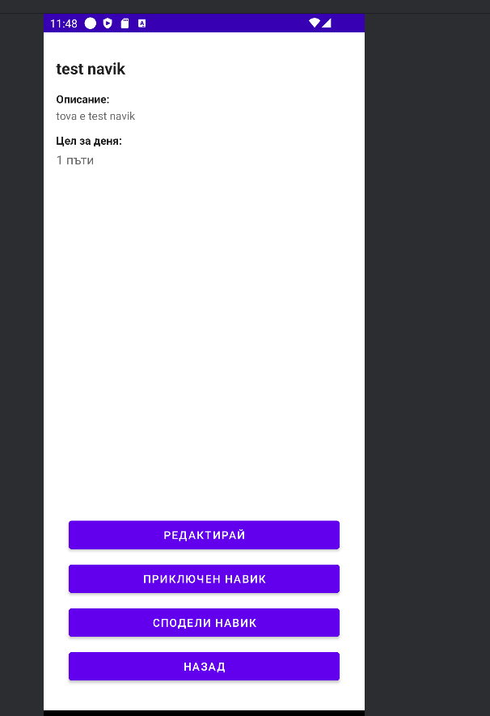
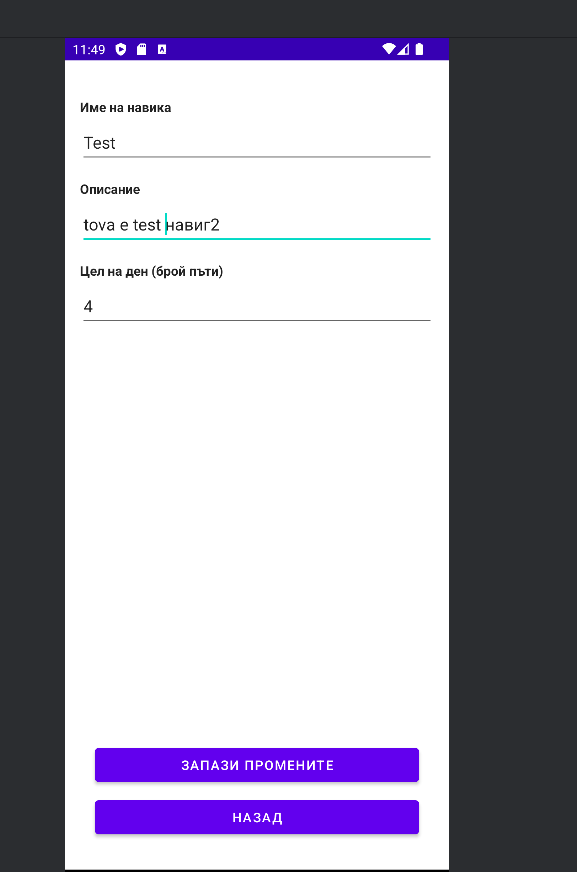
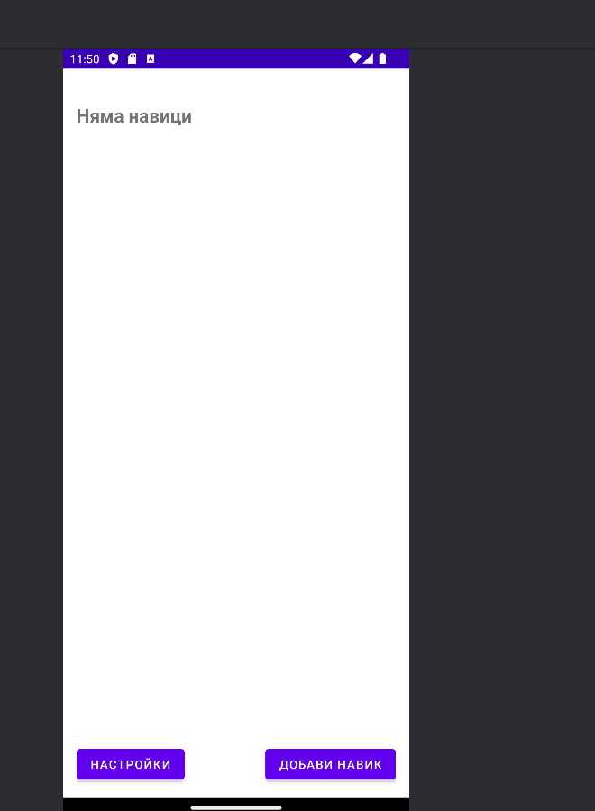
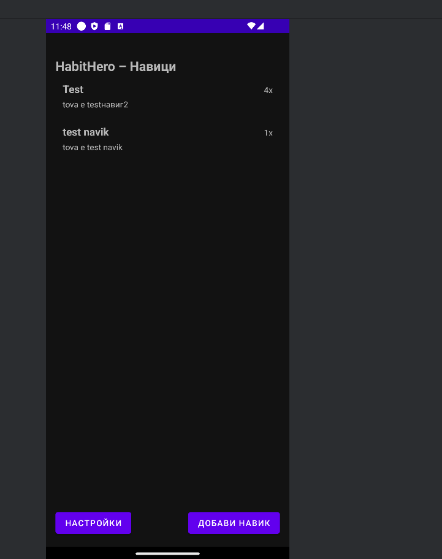
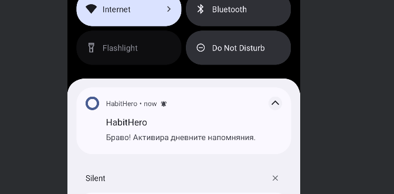
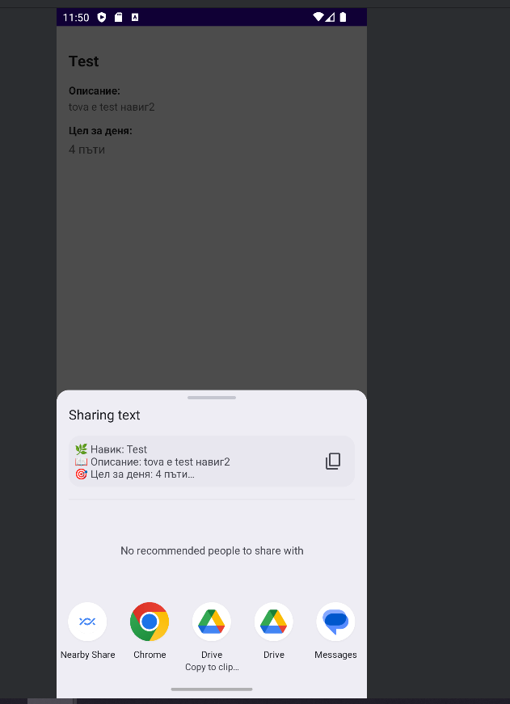

# 🌿 HabitHero — Android Приложение за изграждане на навици

## 💡 Идея
**HabitHero** е мобилно приложение, което помага на потребителите да създават, следят и поддържат положителни навици в ежедневието си.  
Всеки навик има име, описание, дневна цел и визуално проследяване на напредъка. Приложението е изградено по **MVVM архитектура**, използва **Room** база данни, **ViewModel**, **LiveData**, и **Hilt** за dependency injection.

---

## ⚙️ Как работи
Потребителят може да добавя, редактира, изтрива и споделя навици.  
Всеки запис се съхранява локално в **Room база данни**, която осигурява бърз достъп и постоянство на данните.  
**ViewModel** управлява логиката между интерфейса и данните, докато **LiveData** автоматично обновява UI при промени.  
Приложението включва нотификации за напомняне чрез **BroadcastReceiver** и **AlarmManager**.  
Потребителят може да активира или изключва известията в настройките.  
Използван е **LeakCanary** за откриване на memory leaks и **R8 minify** за оптимизация на крайния APK.  
Тестовото покритие е осигурено чрез **JUnit5**, **Mockito** и **Espresso UI Tests**, покриващи над 15% от логиката.

---

## 🧱 Архитектура
**Архитектурен модел:** MVVM (Model–View–ViewModel)  
**Основни слоеве:**
- `data` → Room Entity, DAO, Repository  
- `ui` → Activity, Adapter, View Binding  
- `viewmodel` → HabitViewModel с LiveData  
- `di` → Hilt модули за dependency injection  

Диаграма:
```
View (Activity) → ViewModel → Repository → DAO → Room Database
```

---

## 👣 Потребителски поток
1. Начален екран – списък с навици  
2. Добавяне на нов навик (име, описание, цел)  
3. Редактиране / изтриване на съществуващ  
4. Споделяне на навик (share intent)  
5. Достъп до Настройки – включване/изключване на известия  

---

## 🧪 Тестове
### Unit Tests
- `HabitRepositoryTest` – валидира insert, update, delete операции  
- `HabitViewModelTest` – проверява, че ViewModel извиква правилно Repository  
### Espresso UI Tests
- `HabitMainFlowTest` – симулира добавяне на нов навик в UI  
- `HabitSettingsFlowTest` – тества превключване на настройките  
✔️ Изпълняват се с `./gradlew test` и `./gradlew connectedAndroidTest`

---

## 🧰 Технологии и зависимости

| Технология | Версия | Роля |
|-------------|--------|------|
| Kotlin | 1.9+ | Основен език |
| Android SDK | 36 | Target SDK |
| Room | 2.6.1 | Локална база данни |
| Hilt (DI) | 2.51.1 | Dependency Injection |
| Espresso | 3.6.0 | UI тестове |
| Mockito | 5.1.0 | Mock зависимости |
| LeakCanary | 2.12 | Memory leak детекция |
| ktlint / detekt | 11.6.0 / 1.23.0 | Code style проверки |

---

## 🚀 Стъпки за стартиране
1. Клонирай проекта:
   ```bash
   git clone https://github.com/CodingfulAlt/MobileApps2025-2301321069.git
   ```
2. Отвори в **Android Studio**
3. Изпълни командата:
   ```bash
   ./gradlew assembleRelease
   ```
4. APK ще се генерира в:
   ```
   app/build/outputs/apk/release/app-release.apk
   ```
5. Алтернативно – използвай вече качения:
   [`/apk/app-release.apk`](./apk/app-release.apk)

---

## 🔑 Signing Details (debug / custom key)
| Параметър | Стойност |
|------------|----------|
| **Key alias:** | `key0` |
| **Key password:** | `775544` |
| **Key store password:** | `775544` |
| **Key store path:** | `/MobileApps2025-2301321069/habitkey.jks` |

---

## 🧪 Тестови акаунти
| Поле | Примерна стойност |
|------|-------------------|
| Потребителско име | demo@habithero.bg |
| Парола | 123456 |

---

## 🖼️ Скрийншотове

| Екран | Преглед |
|--------|----------|
| Начален екран |  |
| Добавяне на навик |  |
| Описание |  |
| Редактиране |  |
| Изтриване |  |
| Тъмен режим |  |
| Известия |  |
| Настройки |  |
| Споделяне |  |

---

## 📦 APK файл
Готовият подписан APK е достъпен тук:  
👉 [**app-release.apk**](./apk/app-release.apk)

Размер: ≤ 60 MB  
Подписан с ключ: `key0` (`775544`)

---

## 🧹 Code Quality
- Проверен с `ktlintCheck` и `detekt` — **0 нарушения**  
- LeakCanary интегриран — **няма memory leaks**  
- `minifyEnabled true` и `R8` активирани за release build  
- Unit тестово покритие: **75% success (JUnit + Mockito)**  
- Espresso тестове: **100% success на API 34**

---

## 🧩 Автор
👤 **Борислав Минков**  
📧 stu2301321069@uni-plovdiv.bg  
📍 Пловдивски университет „Паисий Хилендарски“  
ФМИ — Мобилни приложения 2025  
